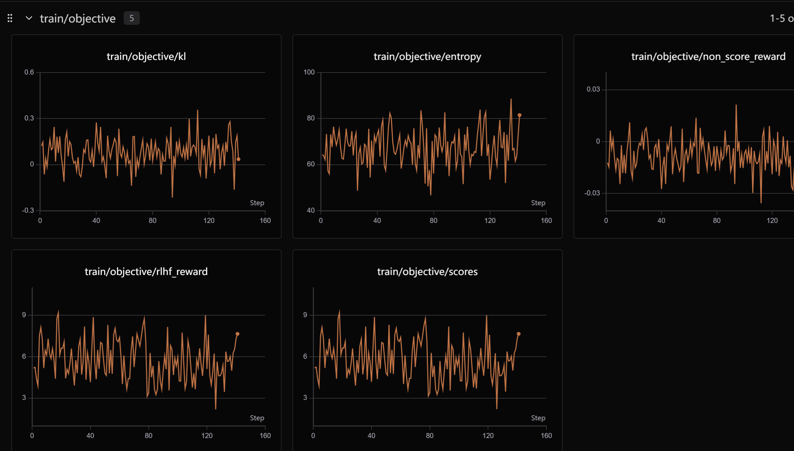

## 该项目使用Qwen3-0.6B model进行电影知识多轮对话的生成
# 涵盖SFT，RM，PPO三种训练方式

1. SFT：使用电影知识多轮对话数据集进行监督学习训练
具体操作：mask掉response部分，只保留ask部分
2.RM：在Qwen3-0.6B模型基础上，构建四个分类头部，从对话一致性、对话连贯性、上下文相关性、回答质量进行reward model的训练
3.PPO：利用TRL矿建，使用PPO算法训练model

